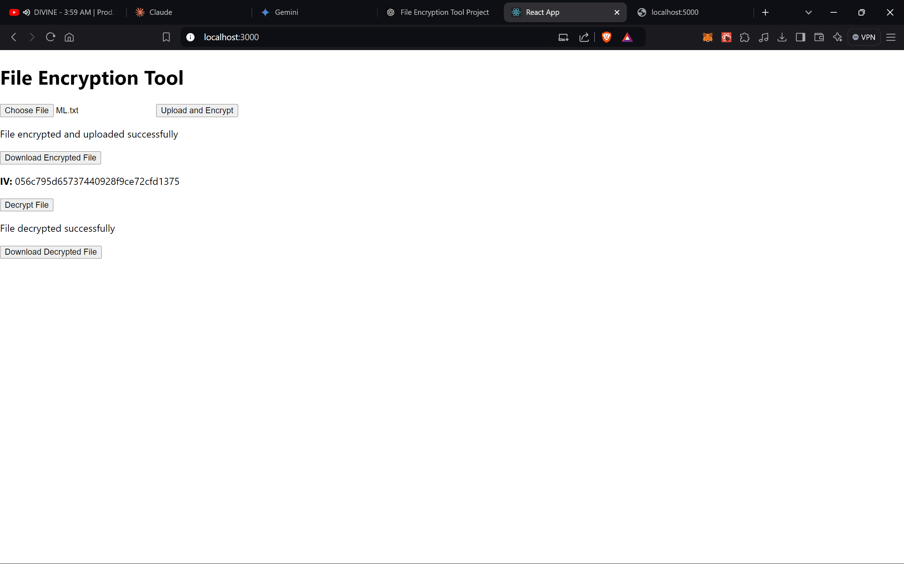

# File-Encryption-Tool - Symmetric Key Encryption

This project provides a simple tool to encrypt and decrypt files using symmetric key encryption (AES-256). It allows users to upload files for encryption and then download the encrypted file. Users can also decrypt the file using the same encryption key (symmetric encryption) along with the initialization vector (IV).

## Features

- Upload any file and encrypt it using AES-256 encryption.
- Download the encrypted file.
- Decrypt the encrypted file using the same key and initialization vector (IV).
- Encryption is done using a randomly generated symmetric key and IV for each session.

## Technologies Used

- **Frontend**: React.js
- **Backend**: Node.js, Express.js
- **Encryption**: AES-256-CTR (Counter Mode)
- **File Storage**: Files are stored and served from the `uploads/` directory

## Installation

### Prerequisites

- **Node.js** installed (version 14.x or higher)
- **npm** (comes with Node.js)
- **React** (create-react-app or use this setup)

### Steps to Install and Run the Project

1. **Clone the repository:**

   ```bash
   git clone https://github.com/ajju-raj/File-Encryption-Tool.git
   cd file-encryption-tool
   ```

2. **Install backend dependencies:**

   Navigate to the `backend/` directory and run:

   ```bash
   cd backend
   npm install
   ```

3. **Install frontend dependencies:**

   Navigate to the `frontend/` directory and run:

   ```bash
   cd frontend
   npm install
   ```

4. **Run the backend server:**

   In the `backend/` directory, run the following command to start the Express server:

   ```bash
   npm start
   ```

   The backend server will be running on `http://localhost:5000`.

5. **Run the React frontend:**

   In the `frontend/` directory, run the following command to start the React development server:

   ```bash
   npm start
   ```

   The frontend app will be running on `http://localhost:3000`.

## Project Structure

The project is divided into two parts: frontend and backend.

- **Backend (`backend/` directory)**:
  - `server.js`: The main Express server where file uploads, encryption, and decryption happen.
  - `uploads/`: Folder where encrypted and decrypted files are stored.
  - **Dependencies**:
    - `crypto`: For AES encryption and decryption.
    - `multer`: For handling file uploads.
    - `fs`: File system module for reading and writing files.
  
- **Frontend (`frontend/` directory)**:
  - `src/App.js`: The main React component where file upload, encryption, and decryption happen.
  - `public/`: Contains static assets (if any).
  - **Dependencies**:
    - `axios`: For making HTTP requests to the backend.

## How It Works

1. **Encrypting a File**:
   - The user uploads a file via the React frontend.
   - The file is sent to the backend, where it is encrypted using AES-256-CTR with a random initialization vector (IV) and a pre-generated secret key.
   - The encrypted file is stored in the `uploads/` directory, and the download link along with the IV is provided to the user.

2. **Decrypting a File**:
   - The user can input the encrypted file path and the IV (from the encryption step) to decrypt the file.
   - The backend decrypts the file and stores the decrypted file in the `uploads/` directory, providing a download link for the user.

## API Endpoints

- **POST** `/upload`
  - Uploads a file and returns the encrypted file path and IV.

- **POST** `/decrypt`
  - Takes the file path and IV, decrypts the file, and returns the decrypted file path.

## Example Usage

1. **Encrypt a file**:
   - Select a file from your computer and upload it.
   - The file will be encrypted, and you will be provided with a link to download the encrypted file, as well as the IV.

2. **Decrypt a file**:
   - Provide the encrypted file's path and the IV.
   - Click the decrypt button, and the file will be decrypted and available for download.

## Screenshots

### Frontend UI



### Backend Server


## Security Considerations

- **Symmetric Key Storage**: In this project, the symmetric key is generated on the fly and used for encryption and decryption during a single session. For production use, key management strategies like storing keys securely (e.g., in a secure vault) should be considered.
- **Initialization Vector (IV)**: A unique IV is used for each encryption to enhance security.
- **Encryption Algorithm**: AES-256-CTR is used for secure encryption.

## Future Improvements

- Add user authentication and permissions for uploading/downloading files.
- Implement secure storage of encryption keys.
- Use a database to keep track of uploaded and encrypted files.

## License

This project is licensed under the MIT License - see the [LICENSE](LICENSE) file for details.


### Contributing

Feel free to submit issues or pull requests if you have suggestions for improvement. Contributions are welcome!
